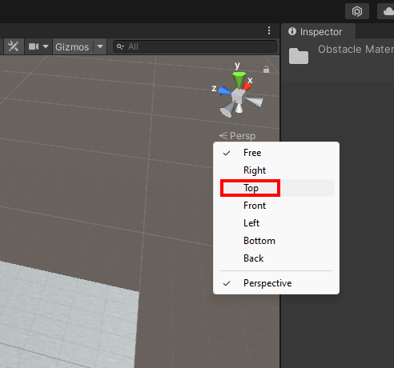
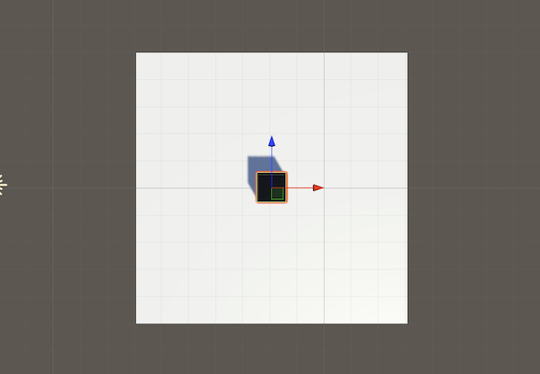
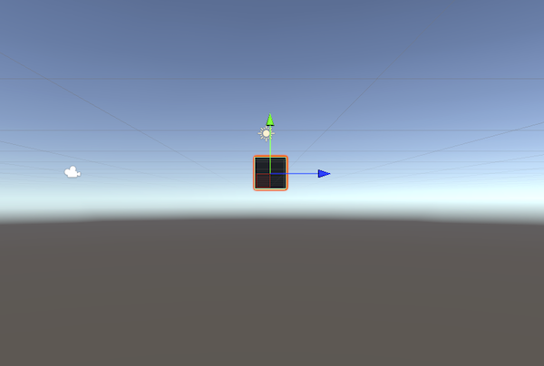

Right-click on **Persp** in the Scene gizmo and choose 'Top' to switch to top-down view:

You should now see your project from the top view. 

You can also choose to view it from the 'Right': 

There is also; 'Left', 'Front', and 'Back'.

Viewing your scene from different angles allows you to place objects more precisely. Make sure to change view regularly to check the position of your objects. 